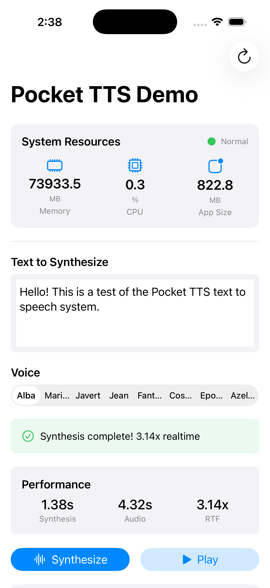

# Pocket TTS iOS

[](https://opensource.org/licenses/MIT)
[](https://developer.apple.com/ios/)
[](https://www.rust-lang.org/)
[](https://opencollective.com/unamentis)
[](https://github.com/UnaMentis/pocket-tts-ios/actions/workflows/rust.yml)
[](https://github.com/UnaMentis/pocket-tts-ios/actions/workflows/ios.yml)
[](https://github.com/UnaMentis/pocket-tts-ios/actions/workflows/security.yml)

Native iOS implementation of Kyutai Pocket TTS using Rust/Candle.

## Overview

This crate provides on-device text-to-speech for iOS using the Kyutai Pocket TTS model. It uses the Candle ML framework for inference and UniFFI for Swift bindings.

## Releases

Pre-built XCFrameworks are available on the [Releases](https://github.com/UnaMentis/pocket-tts-ios/releases) page.

Each release includes:
- `PocketTTS.xcframework` - iOS static library (device + simulator)
- Swift bindings and wrapper files
- Integration documentation

See [docs/INTEGRATION.md](docs/INTEGRATION.md) for detailed integration instructions.

## Demo App

A full-featured iOS demo app is included for testing and validation.

<a href="tests/ios-harness/screenshot.png">
  
</a>

The demo app includes:
- **Text-to-Speech Synthesis** with all 8 built-in voices
- **Real-time Resource Monitoring** (memory, CPU, thermal state)
- **Performance Metrics** (synthesis time, audio duration, RTF)
- **Waveform Visualization** of generated audio
- **Audio Export** for validation testing

See [tests/ios-harness/README.md](tests/ios-harness/README.md) for setup instructions.

## Architecture

```
┌─────────────────────────────────────────────────┐
│              Swift/SwiftUI App                   │
├─────────────────────────────────────────────────┤
│         Generated Swift Bindings (UniFFI)        │
├─────────────────────────────────────────────────┤
│               PocketTTSEngine                    │
├─────────────────────────────────────────────────┤
│  FlowLM    │   MLPSampler   │   MimiDecoder    │
│ (70M)      │    (10M)       │     (20M)        │
└─────────────────────────────────────────────────┘
```

## Building

### Prerequisites

1. Rust toolchain with iOS targets:
   ```bash
   rustup target add aarch64-apple-ios
   rustup target add aarch64-apple-ios-sim
   ```

2. Xcode with iOS SDK

### Build XCFramework

```bash
./scripts/build-ios.sh
```

This creates:
- `target/xcframework/PocketTTS.xcframework` - Static library
- `target/xcframework/pocket_tts_ios.swift` - Swift bindings

### Integration with Xcode

1. Drag `PocketTTS.xcframework` into your Xcode project
2. Add `pocket_tts_ios.swift` to your Swift sources
3. Import and use:

```swift
import Foundation

// Initialize engine with model path
let modelPath = Bundle.main.path(forResource: "kyutai-pocket-ios", ofType: nil)!
let engine = try PocketTTSEngine(modelPath: modelPath)

// Configure
let config = TTSConfig(
    voiceIndex: 0,  // Alba
    temperature: 0.7,
    topP: 0.9,
    speed: 1.0,
    consistencySteps: 2,
    useFixedSeed: false,
    seed: 42
)
try engine.configure(config: config)

// Synthesize
let result = try engine.synthesize(text: "Hello, world!")
// result.audioData contains WAV bytes
```

## Model Files

The model files should be placed in:
```
kyutai-pocket-ios/
├── model.safetensors     # Main model weights (225MB)
├── tokenizer.model       # SentencePiece tokenizer (60KB)
└── voices/               # Voice embeddings (4.2MB)
    ├── alba.safetensors
    ├── marius.safetensors
    ├── javert.safetensors
    ├── jean.safetensors
    ├── fantine.safetensors
    ├── cosette.safetensors
    ├── eponine.safetensors
    └── azelma.safetensors
```

## Features

- **8 Built-in Voices**: Alba, Marius, Javert, Jean, Fantine, Cosette, Eponine, Azelma
- **Streaming Synthesis**: Low-latency audio generation with overlap-add
- **Configurable**: Temperature, top-p, speed, consistency steps
- **CPU Optimized**: Designed for efficient CPU inference

## Performance

- Time to first audio (TTFA): ~200ms
- Real-time factor (RTF): ~3-4x on iPhone 15 Pro
- Memory usage: ~150MB during inference

### Latency Benchmarking

Run latency tests to validate performance:
```bash
./scripts/run-latency-bench.sh --streaming  # Measure TTFA
./scripts/run-latency-bench.sh --all        # Test both modes
```

See [docs/LATENCY_TESTING.md](docs/LATENCY_TESTING.md) for detailed benchmarking instructions.

## Audio Quality Assurance 🎯

**Why**: When optimizing a complex ML pipeline like TTS, it's easy to introduce regressions—small changes that degrade speech quality in subtle ways. Without objective measurements, you might only notice quality degradation after it's too late, or worse, ship degraded audio to users.

**The Challenge**: Getting the last few percentage points of quality requires rigorous validation:
- Is the Rust decoder producing identical output to Python?
- Do optimizations improve or degrade intelligibility?
- Are we introducing noise, distortion, or artifacts?

**Our Solution**: Comprehensive audio quality metrics with automated regression detection.

### Quality Metrics Suite

We measure five key aspects of TTS output quality:

| Metric | What It Measures | Target |
|--------|------------------|--------|
| **WER** (Word Error Rate) | Intelligibility via Whisper ASR | <5% excellent |
| **MCD** (Mel-Cepstral Distortion) | Spectral similarity to reference | <6 dB good |
| **SNR** (Signal-to-Noise Ratio) | Signal health and cleanliness | >25 dB excellent |
| **THD** (Total Harmonic Distortion) | Audio distortion level | <40% acceptable |
| **Spectral** (Centroid, Rolloff, Flatness) | Frequency characteristics | Tracked |

### Automated Regression Detection

Every code change is validated automatically:

1. **Generate Test Audio** - Run full TTS pipeline on standard phrases
2. **Compute Quality Metrics** - Measure all 5 dimensions
3. **Compare to Baseline** - Detect regressions automatically
4. **Block on Failure** - PRs with quality regressions cannot merge

```bash
# Run quality check locally
cd validation
python quality_metrics.py \
  --audio output.wav \
  --text "Hello, this is a test." \
  --whisper-model base \
  --output-json quality_results.json

# Compare to baseline
python baseline_tracker.py \
  --check-regression \
  --baseline baselines/baseline_v0.4.1.json \
  --metrics quality_results.json
```

### CI Integration

Quality metrics run automatically in GitHub Actions:

- **On Pull Requests**: Check for regressions (blocking)
- **On Main Branch**: Update baseline after successful merge
- **Quality Reports**: Uploaded as artifacts for every run

See [validation/README.md](validation/README.md) for detailed usage.

### Meta-Validation: Testing the Tests

Before trusting quality metrics, we validate them against known cases:

- ✅ **Run 0** (Meta-validation): Test metrics on synthetic audio with known properties
- ✅ **Run 1** (Sanity check): Verify metrics produce reasonable values on real TTS
- 🔄 **Run 2** (Cross-validation): Compare Rust vs Python outputs
- 🔄 **Run 3** (Stability check): Verify metrics are stable across runs

Only after all validation runs pass do we establish the quality baseline.

**Docs**:
- [validation/docs/QUALITY_METRICS.md](validation/docs/QUALITY_METRICS.md) - Metric definitions and formulas
- [validation/docs/ITERATIVE_VALIDATION.md](validation/docs/ITERATIVE_VALIDATION.md) - Validation process
- [validation/docs/REGRESSION_DETECTION.md](validation/docs/REGRESSION_DETECTION.md) - Usage guide

### Why This Matters

This system enables us to:
- **Catch regressions early** - Before they reach production
- **Optimize confidently** - Know if changes help or hurt quality
- **Track progress** - Quantify improvements over time
- **Ship with confidence** - Every release is validated against baseline

The last few percentage points of quality matter—they're the difference between "good enough" and "production ready."

## Development Quality

This project uses comprehensive development infrastructure:

- **Pre-commit hooks**: rustfmt, clippy, gitleaks, tests
- **CI/CD pipelines**: Lint, test, coverage, iOS build, security scan
- **Code coverage**: cargo-tarpaulin with 70% minimum threshold
- **AI review**: CodeRabbit integration

See [docs/quality/QUALITY_PLAN.md](docs/quality/QUALITY_PLAN.md) for details.

## Credits

This implementation builds upon excellent work from:

- **[Kyutai Labs](https://kyutai.org/)** - Original Pocket TTS model architecture and trained weights
- **[babybirdprd/pocket-tts](https://github.com/babybirdprd/pocket-tts)** - Complete Rust/Candle port that made iOS integration possible
- **[HuggingFace Candle](https://github.com/huggingface/candle)** - ML framework for efficient inference

See [ATTRIBUTION.md](ATTRIBUTION.md) for detailed attribution information.

## License

MIT (code), CC-BY-4.0 (model weights)
