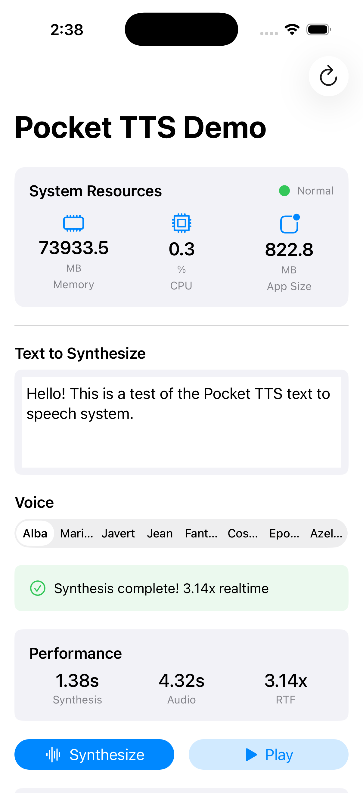

# Pocket TTS iOS

[](https://opensource.org/licenses/MIT)
[](https://developer.apple.com/ios/)
[](https://www.rust-lang.org/)
[](https://opencollective.com/unamentis)
[](https://github.com/UnaMentis/pocket-tts-ios/actions/workflows/rust.yml)
[](https://github.com/UnaMentis/pocket-tts-ios/actions/workflows/ios.yml)
[](https://github.com/UnaMentis/pocket-tts-ios/actions/workflows/security.yml)

Native iOS implementation of Kyutai Pocket TTS using Rust/Candle.

## Overview

This crate provides on-device text-to-speech for iOS using the Kyutai Pocket TTS model. It uses the Candle ML framework for inference and UniFFI for Swift bindings.

## Releases

Pre-built XCFrameworks are available on the [Releases](https://github.com/UnaMentis/pocket-tts-ios/releases) page.

Each release includes:
- `PocketTTS.xcframework` - iOS static library (device + simulator)
- Swift bindings and wrapper files
- v1 model weights (`Models/`) — v2 weights are gated and must be downloaded
  separately (see [Obtaining model weights](#obtaining-model-weights))
- Integration documentation

See [docs/INTEGRATION.md](docs/INTEGRATION.md) for detailed integration instructions.

## Demo App

A full-featured iOS demo app is included for testing and validation.

<a href="tests/ios-harness/screenshot.png">
  
</a>

The demo app includes:
- **Text-to-Speech Synthesis** with all 8 built-in voices
- **Real-time Resource Monitoring** (memory, CPU, thermal state)
- **Performance Metrics** (synthesis time, audio duration, RTF)
- **Waveform Visualization** of generated audio
- **Audio Export** for validation testing

See [tests/ios-harness/README.md](tests/ios-harness/README.md) for setup instructions.

## Architecture

```
┌─────────────────────────────────────────────────┐
│              Swift/SwiftUI App                   │
├─────────────────────────────────────────────────┤
│         Generated Swift Bindings (UniFFI)        │
├─────────────────────────────────────────────────┤
│               PocketTtsEngine                    │
├─────────────────────────────────────────────────┤
│  FlowLM    │   MLPSampler   │   MimiDecoder    │
│ (70M)      │    (10M)       │     (20M)        │
└─────────────────────────────────────────────────┘
```

## Building

### Prerequisites

1. Rust toolchain with iOS targets:
   ```bash
   rustup target add aarch64-apple-ios
   rustup target add aarch64-apple-ios-sim
   ```

2. Xcode with iOS SDK

### Build XCFramework

```bash
./scripts/build-ios.sh
```

This creates:
- `target/xcframework/PocketTTS.xcframework` - Static library
- `target/xcframework/pocket_tts_ios.swift` - Swift bindings

### Integration with Xcode

1. Drag `PocketTTS.xcframework` into your Xcode project
2. Add `pocket_tts_ios.swift` to your Swift sources
3. Import and use:

```swift
import Foundation
import AVFoundation

// Initialize engine with the model directory bundled as "Models"
// (contains model.safetensors, tokenizer.model, voices/). See docs/INTEGRATION.md.
let modelPath = Bundle.main.path(forResource: "Models", ofType: nil)!
let engine = try PocketTtsEngine(modelPath: modelPath)

// Configure. TtsConfig has no default field values — all fields are required.
let config = TtsConfig(
    voiceIndex: 0,          // 0 = Alba
    temperature: 0.7,
    topP: 0.9,
    speed: 1.0,
    consistencySteps: 2,
    useFixedSeed: false,
    seed: 42
)
try engine.configure(config: config)

// Synthesize. result.audioData is a COMPLETE WAV file (Int16 PCM, 24 kHz, mono).
let result = try engine.synthesize(text: "Hello, world!")

// Play it directly — AVAudioPlayer reads the WAV header.
let player = try AVAudioPlayer(data: result.audioData)
player.play()
```

> Prefer sensible defaults? Use the `PocketTTSSwift` actor wrapper
> (`init(modelPath:)` then `load()`), whose `Config` presets supply defaults.
> See [docs/INTEGRATION.md](docs/INTEGRATION.md) for the wrapper, streaming
> (raw PCM chunks), and `PocketTtsError` handling.

## Model Files

### Model versions

v0.5.0 supports both Pocket TTS model generations. The engine auto-detects
which voice-file format it is given and errors clearly on anything else.

| | v1 (`english_2026-01`) | v2 (`english_2026-04`) |
|---|---|---|
| Hugging Face repo | `kyutai/pocket-tts-without-voice-cloning` (public) | `kyutai/pocket-tts` (gated) |
| Voice file format | Embedding sequence (`audio_prompt`, `[1, seq, 1024]`) | Precomputed transformer KV-state (`transformer.layers.{i}.self_attn/cache`, `bos_before_voice` + speaker projection baked in) |
| Model directory | `kyutai-pocket-ios/` | `kyutai-pocket-ios-en2026-04/` |
| TTFA (host, 2026-06-11) | 252ms avg | 137ms avg |

The two voice formats are incompatible with each other — use voices from the
same generation as the model weights.

Each model directory has the same layout (8 voices each):

```
kyutai-pocket-ios/            # v1   (kyutai-pocket-ios-en2026-04/ for v2)
├── model.safetensors     # Main model weights (225MB)
├── tokenizer.model       # SentencePiece tokenizer (60KB)
└── voices/               # Voice files
    ├── alba.safetensors
    ├── marius.safetensors
    ├── javert.safetensors
    ├── jean.safetensors
    ├── fantine.safetensors
    ├── cosette.safetensors
    ├── eponine.safetensors
    └── azelma.safetensors
```

Both directories are gitignored — obtain the weights as described below.

### Obtaining model weights

```bash
# v1 (english_2026-01) — public repo, no login needed
python scripts/download-model.py

# v2 (english_2026-04) — gated repo, requires Hugging Face access
python scripts/download-model.py --model v2
```

For v2, the weights live in the **gated** repo
[kyutai/pocket-tts](https://huggingface.co/kyutai/pocket-tts):

1. Visit https://huggingface.co/kyutai/pocket-tts and accept the gate
2. Authenticate locally with `huggingface-cli login`, or set the `HF_TOKEN`
   environment variable for the download run
3. Run `python scripts/download-model.py --model v2`

**Redistribution policy**: v2 weights are never redistributed in this
project's release artifacts, respecting Kyutai's gate. The release zip bundles
v1 weights only (as before); every v2 user downloads the weights directly from
Hugging Face.

## Features

- **8 Built-in Voices**: Alba, Marius, Javert, Jean, Fantine, Cosette, Eponine, Azelma
- **Streaming Synthesis**: Low-latency audio generation with overlap-add
- **Configurable**: Temperature, top-p, speed, consistency steps
- **CPU Optimized**: Designed for efficient CPU inference

## Performance

> **No physical-device measurements exist yet.** Every number below was
> measured on either an Apple-silicon **Mac host** or the **iOS Simulator** —
> neither reflects real-iPhone performance. A device smoke test (load +
> synthesize on a physical iPhone) is a hard pre-release gate; see
> [docs/RELEASE_CHECKLIST.md](docs/RELEASE_CHECKLIST.md).

**Mac host (Apple silicon), release build, streaming mode, 2026-06-11** — this
is a development-machine measurement, not iOS:

| Metric | v2 (english_2026-04) | v1 (english_2026-01) |
|--------|----------------------|----------------------|
| TTFA (avg) | 137ms (short 147 / medium 118 / long 146ms) | 252ms |
| RTF | 2.94x | 2.64x |

**iOS Simulator (iPhone 17 Pro sim, not a physical device), 2026-06-06** — v2 only:

| Metric | Value |
|--------|-------|
| TTFA | 159ms (streaming) |
| RTF | 2.70x streaming / 3.20x sync |
| Model load | 0.29s |

v1 is slower to first audio because v1 voices run a 125-position prompt
through the transformer at synthesis start; v2 voices are precomputed KV
states. Memory usage is ~150MB during inference on the host; on device expect a
higher resident footprint (~470MB) once F32 weights are loaded — see
[docs/INTEGRATION.md](docs/INTEGRATION.md) Deployment notes.

### Latency Benchmarking

Run latency tests to validate performance:
```bash
./scripts/run-latency-bench.sh --streaming  # Measure TTFA
./scripts/run-latency-bench.sh --all        # Test both modes
```

See [docs/LATENCY_TESTING.md](docs/LATENCY_TESTING.md) for detailed benchmarking instructions.

## Audio Quality Assurance 🎯

**Why**: When optimizing a complex ML pipeline like TTS, it's easy to introduce regressions—small changes that degrade speech quality in subtle ways. Without objective measurements, you might only notice quality degradation after it's too late, or worse, ship degraded audio to users.

**The Challenge**: Getting the last few percentage points of quality requires rigorous validation:
- Is the Rust decoder producing identical output to Python?
- Do optimizations improve or degrade intelligibility?
- Are we introducing noise, distortion, or artifacts?

**Our Solution**: Comprehensive audio quality metrics with automated regression detection.

### Quality Metrics Suite

We measure five key aspects of TTS output quality:

| Metric | What It Measures | Target |
|--------|------------------|--------|
| **WER** (Word Error Rate) | Intelligibility via Whisper ASR | <5% excellent |
| **MCD** (Mel-Cepstral Distortion) | Spectral similarity to reference | <6 dB good |
| **SNR** (Signal-to-Noise Ratio) | Signal health and cleanliness | >25 dB excellent |
| **THD** (Total Harmonic Distortion) | Audio distortion level | <40% acceptable |
| **Spectral** (Centroid, Rolloff, Flatness) | Frequency characteristics | Tracked |

### Automated Regression Detection

Every code change is validated automatically:

1. **Generate Test Audio** - Run full TTS pipeline on standard phrases
2. **Compute Quality Metrics** - Measure all 5 dimensions
3. **Compare to Baseline** - Detect regressions automatically
4. **Block on Failure** - PRs with quality regressions cannot merge

```bash
# Run quality check locally
cd validation
python quality_metrics.py \
  --audio output.wav \
  --text "Hello, this is a test." \
  --whisper-model base \
  --output-json quality_results.json

# Compare to baseline
python baseline_tracker.py \
  --check-regression \
  --baseline baselines/baseline_v0.5.0.json \
  --metrics quality_results.json
```

### CI Integration

Quality metrics run automatically in GitHub Actions:

- **On Pull Requests**: Check for regressions (blocking)
- **On Main Branch**: Update baseline after successful merge
- **Quality Reports**: Uploaded as artifacts for every run

See [validation/README.md](validation/README.md) for detailed usage.

### Meta-Validation: Testing the Tests

Before trusting quality metrics, we validate them against known cases:

- ✅ **Run 0** (Meta-validation): Test metrics on synthetic audio with known properties
- ✅ **Run 1** (Sanity check): Verify metrics produce reasonable values on real TTS
- 🔄 **Run 2** (Cross-validation): Compare Rust vs Python outputs
- 🔄 **Run 3** (Stability check): Verify metrics are stable across runs

Only after all validation runs pass do we establish the quality baseline.

**Docs**:
- [validation/docs/QUALITY_METRICS.md](validation/docs/QUALITY_METRICS.md) - Metric definitions and formulas
- [validation/docs/ITERATIVE_VALIDATION.md](validation/docs/ITERATIVE_VALIDATION.md) - Validation process
- [validation/docs/REGRESSION_DETECTION.md](validation/docs/REGRESSION_DETECTION.md) - Usage guide

### Why This Matters

This system enables us to:
- **Catch regressions early** - Before they reach production
- **Optimize confidently** - Know if changes help or hurt quality
- **Track progress** - Quantify improvements over time
- **Ship with confidence** - Every release is validated against baseline

The last few percentage points of quality matter—they're the difference between "good enough" and "production ready."

## Autonomous Quality Optimization

An [autoresearch](https://github.com/karpathy/autoresearch)-style optimization loop that autonomously improves TTS audio quality. An AI agent iteratively modifies parameters or code, evaluates against a composite quality score, keeps improvements, and discards regressions — looping indefinitely toward a perfect score.

**How it works**: Each iteration follows: REMEMBER → ANALYZE → CHECK (dead ends) → MODIFY one thing → EVALUATE → COMPARE → DECIDE (commit or reset) → RECORD → REPEAT. A persistent memory system tracks dead ends, promising leads, and learned rules across sessions so the agent never repeats mistakes.

```bash
# Phase 1: Establish baseline
python autotuning/autotune.py --phase baseline --model-dir kyutai-pocket-ios

# Phase 2: Sweep individual parameters
python autotuning/autotune.py --phase sweep --param temperature --model-dir kyutai-pocket-ios

# Phase 3: Joint optimization
python autotuning/autotune.py --phase optimize --iterations 100 --model-dir kyutai-pocket-ios

# Phase 4: Autonomous AI agent loop (start a fresh Claude Code session, paste autotuning/program.md)
```

The composite score combines intelligibility (40%, WER), acoustic similarity (25%, MCD), signal quality (15%, SNR), waveform correlation (10%), and low distortion (10%, THD) into a single 0-1 scalar.

See [autotuning/README.md](autotuning/README.md) for details and [docs/research/autoresearch-tts-adaptation.md](docs/research/autoresearch-tts-adaptation.md) for the full design document.

## Development Quality

This project uses comprehensive development infrastructure:

- **Pre-commit hooks**: rustfmt, clippy, gitleaks, tests
- **CI/CD pipelines**: Lint, test, coverage, iOS build, security scan
- **Code coverage**: cargo-tarpaulin with 70% minimum threshold
- **AI review**: CodeRabbit integration

**Debugging note**: the library is silent by default (one-shot messages sit
behind `log::debug`). The `.npy` tensor-dump tooling used for parity debugging
is gated behind the `diagnostics` cargo feature — build with
`cargo build --features diagnostics` when you need intermediate tensor dumps.

See [docs/quality/QUALITY_PLAN.md](docs/quality/QUALITY_PLAN.md) for details.

## Credits

This implementation builds upon excellent work from:

- **[Kyutai Labs](https://kyutai.org/)** - Original Pocket TTS model architecture and trained weights
- **[babybirdprd/pocket-tts](https://github.com/babybirdprd/pocket-tts)** - Complete Rust/Candle port that made iOS integration possible
- **[HuggingFace Candle](https://github.com/huggingface/candle)** - ML framework for efficient inference

See [ATTRIBUTION.md](ATTRIBUTION.md) for detailed attribution information.

## License

MIT (code), CC-BY-4.0 (model weights)
